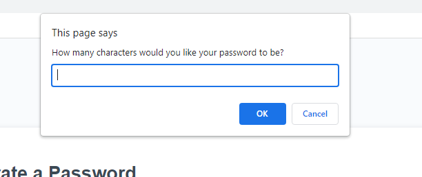

# password-generator

## Technology Used 

| Technology Used         | Resource URL           | 
| ------------- |:-------------:| 
| JavaScript    | [https://www.w3schools.com/js/default.asp](https://www.w3schools.com/js/default.asp) | 

## Table of Contents

1. [Description](#description)
2. [Given Starter Code](#given-starter-code)
3. [Usage](#usage)
4. [Learning Points](#learning-points)
5. [Author Info](#author-info)

## Description

[Password Generator](https://darrenkwatanabe.github.io/password-generator/)

For this assignment, we were given the starter code for a password generator and were tasked to prompt the user if they would
like the following criteria in their password:

1. Lower case letters
2. Upper case letters
3. Numbers
4. Special Characters " !"#$%&'()*+,-./:;<=>?@[\]^_`{|}~"

We were to apply the material we had learned here, which included the use of arrays, popup boxes, variables, and functions. We 
had to utilize the prompt boxes to ask user's what to include in their password. If their password didn't fit the requirements,
we used an alert box to notify them to select a password length that fits. Once fulfilled, then we used confirm boxes to confirm
with the user if they wanted to include the criteria mentioned above.

## Given Starter Code 

We were given the following starter code in JavaScript:

``` JavaScript
// Assignment code here


// Get references to the #generate element
var generateBtn = document.querySelector("#generate");

// Write password to the #password input
function writePassword() {
  var password = generatePassword();
  var passwordText = document.querySelector("#password");

  passwordText.value = password;

}

// Add event listener to generate button
generateBtn.addEventListener("click", writePassword);
``` 

## Usage

First we are displayed with the webpage with a generate password button. 


After clicking the generate password button, the user is prompted with an option of their desired password length.



Then user is shown boxes to confirm desired usage of lower case letters, upper case letters, numbers, and/or special characters.

 <br>
 <br>
 <br>


## Learning Points

This project was very helpful as I learned how to utilize arrays and be able to merge them with a newly created array. Also, by using the Math.floor 
and Math.random objects, this allowed me to randomize from the array list to generate a password. I still need work on writing the code to generate
the password with using the arrays, but I feel like I've learned a lot when it comes to the for loops being used for this task.

## Author Info

Darren Watanabe <br>
UC Berkeley Coding Bootcamp Student <br>
Email: watanabedarren@yahoo.com <br>
[Github](https://github.com/Darrenkwatanabe) <br>
[LinkedIn](https://www.linkedin.com/in/darren-watanabe-982526253/)